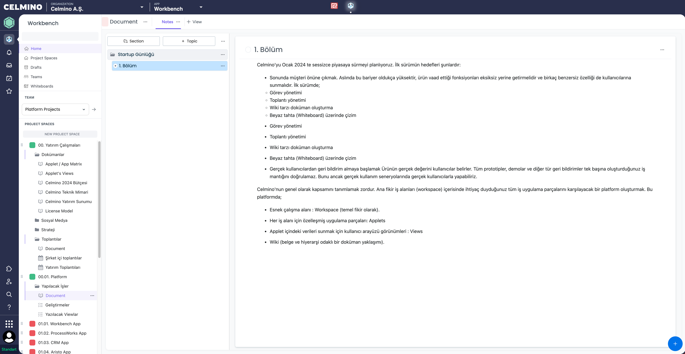
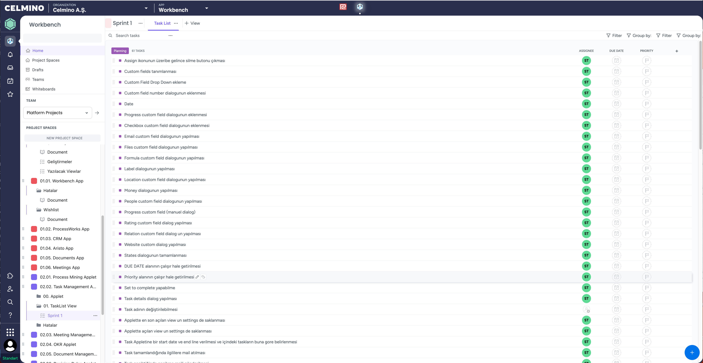

```
Ürün:                   Celmino — SaaS B2B work management studio
Durum:                  Alpha (henüz production versiyonu yok)
Çıkış:                  Ocak 2024 (sessizce, davet usulu ile)
Geliştirme geçen süre:  15 ay
Müşteri Adayları:       20
Mevcut müşteriler:      1 (Kendi içimizde kullanıyoruz. 😋)
Geliştirme ekibi:       4 kişi
MRR:                    $0

```

Bizler Celmino'da şeffaf girişim(Open Startup) ve şeffaf geliştirme (Open Development) prensiplerini benimsedik. Bu sebeple Celmino'yu adım adım geliştirirken bu süreçlerde yaşadığımız tecrübeleri de aylık olarak buradan paylaşacağız. Aynı mantıkla **Open Development** çerçevesinde aşağıdaki konularda da çeşitli paylaşımlarda bulunacağız.

- Ürün geliştirme prensiplerimiz
- Ürün yapısı
- Müşteri geri bildirimlerini nasıl topluyoruz ve değerlendiriyoruz.
- Yeni müşteri keşfetmek ve ilk görüşmeler için yaptıklarımız.
- Ürün kullanım istatistikleri
- Stratejilerimiz, nasıl takip ediyoruz ve değerlendiriyoruz.
- Kullanıcı senaryolarını nasıl tanımlıyoruz.
- Geliştirme önceliklerimizi nasıl belirliyoruz.
- Yeni talepleri nasıl ele alıyoruz.
- Haftalık toplantılar, toplantı gündem maddeleri nasıl belirleniyor ve takip ediliyor.
- Haftalık sürümler.
- Ürün Roadmap'i nasıl belirliyoruz ve mevcuttaki roadmap.
- Kullanıcıları geliştirmelerden haberdar etmek için changelog (değişiklik günlüğü).
- Aktif kullanıcılardan geri bildirimler almak için ürün topluluğu oluşturulması.
- Ürün Dokümantasyonu.
  

Yukarıdaki maddelere ek olarak paylaşmamı istediğiniz konular ve ya süreçler olursa bana [LinkedIn](https://www.linkedin.com/in/selim-tan-5a852040) üzerinden ulaşabilirsiniz.

Celmino'yu Ocak 2024 te sessizce piyasaya sürmeyi planlıyoruz. İlk sürümün hedefleri ise:

- **Sonunda müşteri önüne çıkmak**. Aslında bu bariyer oldukça yüksektir, ürün vaad ettiği fonksiyonları eksiksiz yerine getirmelidir ve birkaç benzersiz özelliği de kullanıcılarına sunmalıdır. İlk sürümde;
  - Görev yönetimi
  - Toplantı yönetimi
  - Wiki tarzı doküman oluşturma
  - Beyaz tahta (Whiteboard) üzerinde çizim

- **Gerçek kullanıcılardan geri bildirim almaya başlamak** Ürünün gerçek değerini kullanıcılar belirler. Tüm prototipler,  demolar ve diğer tür geri bildirimler tek başına oluşturduğunuz iş mantığını doğrulamaz. Bunu ancak gerçek kullanım seneryolarında gerçek kullanıcılarla yapabiliriz.

Celmino'nun genel olarak kapsamını tanımlamak zordur. Ana fikir iş alanları (workspace) içerisinde ihtiyaç duyduğunuz tüm iş uygulama parçalarını karşılayacak bir platform oluşturmak. Bu platformda;

- Esnek çalışma alanı : **Workspace** (temel fikir olarak).
- Her iş alanı için özelleşmiş uygulama parçaları: **Applets**
- Applet içindeki verileri sunmak için kullanıcı arayüzü görünümleri : **Views** 
- Wiki (belge ve hiyerarşi odaklı bir doküman yaklaşımı).


## Demolar ve Geri Bildirim
Potansiyel müşterilere birkaç demo yaptık ve ilk geri bildirimleri toplamaya başladık. Tüm bu bilgileri takip etmek için Celmino içinde bir hiyerarşi oluşturduk. İşte o uygulama.


Yaptığımız demolarda genel geri bildirim olumluydu. Bu dönüşler motivasyonumuzu yukarıda tutmamızıda sağlamıştı.
Bu dönüşlerden bazıları;

- Bütünsel bir yaklaşım olduğu konusunda herkes hemfikir.
- Potansiyel olarak farklı uygulamalara ev sahipliği yapabilir.

Gerçekten de başlangıç aşamasına hiç dikkat etmedik, bu yüzden her şey çok esnek görünüyor, ancak içine atlamak kolay değil. Bazı Şablonlar, Çözümler veya Paketler ile başlangıç deneyimi hakkında derinlemesine düşünmeliyiz.

## Wiki

Wiki'nin Celmino'da çok önemli bir yeri olduğunu düşünüyoruz. İnsanlar Belgeler ile başlamayı ve daha sonra çalışmalarını derinleştirmeyi severler.




## Gelişime genel bakış

Şu ana kadar aslında planladıklarımızdan daha azını yaptık. Henüz hiç el atamadığımız uygulama içi bildirimler, mentionlar, görüş paylaşımı vb. özelliklerde çok geride kaldık. Bu özellikleri Ocak ayına kadar tamamlamamız gerekiyor. Görev listesinin bir kesiti;



## Riskler ve diğer düşünceler
Ürün şekilleniyor ve giderek daha fazla fırsat görüyoruz. Çeşitli alanlara uygulanabiliyor ve insanlar potansiyeli görünce heyecanlanıyor.

Şu anda öngördüğüm ana riskler:

- Ürünü ilk kullanmaya başlamak zor olabilir. Workspace, Applet, View mantığını kavramak, Celmino hiyerarşisini anlamak zaman gerektirebilir. Bu nedenle canlı demolar aracılığıyla birebir kullanım senaryoları kullanmalıyız. İnsanlara bu şekilde ürünü kullanmayı anlatmalıyız.

- Geliştirme hızımız ekip büyüklüğüne bağlı olarak biraz yavaş, ama motivasyonumuz ve ekibin morali de oldukça iyi. Ancak production sürümü olmadan geçen 15 ay bizi her anlamda zorladı. Ocak ayında hazır hale getirip piyasaya sürmemiz gerekiyor. 

- Ürünün şu anda performansı biraz belirsiz. 1-50 kişi için hızlı olacağından oldukça eminiz, ancak 1000 kişi için durum ne olacak? Ancak, bu çözülebilecek teknik bir konu olduğu için performans konusunda çok fazla endişelenmiyorum.

### devam edecek