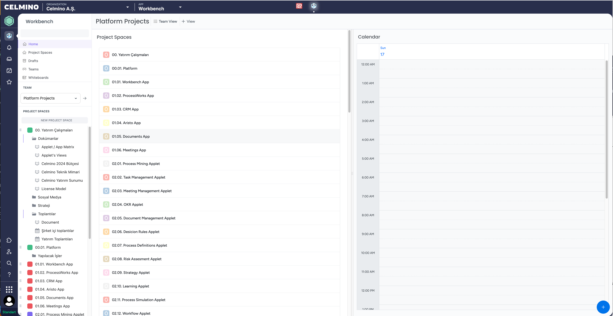

```
Ürün:                   Celmino — SaaS B2B work management studio
Durum:                  Alpha (henüz production versiyonu yok)
Çıkış:                  Ocak 2024 (sessizce, davet usulu ile)
Geliştirme geçen süre:  15 ay
Müşteri Adayları:       20
Mevcut müşteriler:      1 (Kendi içimizde kullanıyoruz. 😋)
Geliştirme ekibi:       4 kişi
MRR:                    $0

```

Bizler Celmino'da şeffaf girişim(Open Startup) ve şeffaf geliştirme (Open Development) prensiplerini benimsedik. Bu sebeple Celmino'yu adım adım geliştirirken bu süreçlerde yaşadığımız tecrübeleri de aylık olarak buradan paylaşacağız. Aynı mantıkla **Open Development** çerçevesinde aşağıdaki konularda da çeşitli paylaşımlarda bulunacağız.

- Ürün geliştirme prensiplerimiz
- Ürün yapısı
- Müşteri geri bildirimlerini nasıl topluyoruz ve değerlendiriyoruz.
- Yeni müşteri keşfermek ve ilk görüşmeler
- Ürün kullanım istatistikleri
- Stratejilerimiz, nasıl takip ediyoruz ve değerlendiriyoruz.
- Kullanıcı senaryolarını nasıl tanımlıyoruz.
- Geliştirme önceliklerimiz nasıl belirliyoruz.
- Yeni talepleri nasıl ele alıyoruz.
- Haftalık toplantılar, toplantı gündem maddeleri nasıl belirleniyor ve takip ediliyor.
- Haftalık sürümler.
- Ürün Roadmap'i nasıl belirliyoruz ve mevcuttaki roadmap.
- Kullanıcıları geliştirmelerden haberdar etmek için changelog (değişiklik günlüğü).
- Aktif kullanıcılardan geri bildirimler almak için ürün topluluğu oluşturulması.
- Ürün Dokümantasyonu.
  

Yukarıdaki maddelere ek olarak paylaşmamı istediğiniz konular ve ya süreçler olursa bana [LinkedIn](https://www.linkedin.com/in/selim-tan-5a852040) üzerinden ulaşabilirsiniz.

Celmino'yu Ocak 2024 te sessizce piyasaya sürmeyi planlıyoruz. İlk sürümün hedefleri şunlardır:

- **Sonunda müşteri önüne çıkmak**. Aslında bu bariyer oldukça yüksektir, ürün vaad ettiği fonksiyonları eksiksiz yerine getirmelidir ve birkaç benzersiz özelliği de kullanıcılarına sunmalıdır. İlk sürümde;
  - Görev yönetimi
  - Toplantı yönetimi
  - Wiki tarzı doküman oluşturma
  - Beyaz tahta (Whiteboard) üzerinde çizim

- **Gerçek kullanıcılardan geri bildirim almaya başlamak** Ürünün gerçek değerini kullanıcılar belirler. Tüm prototipler,  demolar ve diğer tür geri bildirimler tek başına oluşturduğunuz iş mantığını doğrulamaz. Bunu ancak gerçek kullanım seneryolarında gerçek kullanıcılarla yapabiliriz.
Pivotlama ve deneyler için bir temel oluşturun.

İlk yarı kamuya açık sürümün kapsamını tanımlamak her zaman zordur. Ana fikre (esnek alan) ve verilerle çalışmak için bazı görselleştirmelere odaklanmaya karar verdik:

- Esnek çalışma alanı : **Workspace** (temel fikir olarak).
- Her iş alanı için özelleşmiş uygulama parçaları: **Applets**
- Applet içindeki verileri sunmak için kullanıcı arayüzü görünümleri : **Views** 
- Wiki (belge ve hiyerarşi odaklı bir yaklaşım).


## Demolar ve Geri Bildirim
Potansiyel müşterilere birkaç demo yaptık ve ilk geri bildirimleri toplamaya başladık. Tüm bu bilgileri takip etmek için Celmino içinde bir hiyerarşi oluşturduk. İşte o uygulama.




Yaptığımız demolarda genel geri bildirim olumluydu. Bu dönüşler motivasyonumuzu yukarıda tutmamızıda sağlamıştı.
Bu dönüşlerden bazıları;

- Yeni bir yaklaşıma benziyor.
- İyi tasarım, modern ve hafif. Şimdiye kadar meraklılar için bir ürün gibi görünüyor (Şablonlar önemlidir ve başlamak için AĞIR yatırım yapmak gerekir). Çok iyi bir başlangıç.

Gerçekten de başlangıç aşamasına hiç dikkat etmedik, bu yüzden her şey çok esnek görünüyor, ancak içine atlamak kolay değil. Bazı Şablonlar, Çözümler veya Paketler ile başlangıç deneyimi hakkında derinlemesine düşünmeliyiz.

## Wiki

Wiki'nin Celmino'da çok önemli bir yeri olduğunu düşünüyoruz. İnsanlar Belgeler ile başlamayı ve daha sonra çalışmalarını derinleştirmeyi severler.

## Image here

Ağustos ayında Görsel yükleme imkanı ekledik ve Wiki'yi Zengin Düzenleme alanına dönüştürdük. Bu, HERHANGİ bir varlığa ortak çalışma alanı ekleyebileceğiniz anlamına gelir. İşte Özellik spesifikasyonu üzerinde nasıl işbirliği yaptığımıza dair bir örnek:

Özellik veya Kullanıcı Hikayesi üzerinde işbirliği yapmak imkansız olduğu için çoğu zaman insanlar spesifikasyonları ayrı belgeler halinde yazarlar. Fibery'de bu ayrıma gerek yoktur. Her varlık içinde işbirliğine dayalı düzenleme yapabilirsiniz.

## Image here

Yayınlanana kadar Board kullanıcı arayüzüne büyük yatırım yapmayacağız, çünkü bunu yapmak için gerçek geri bildirime ihtiyacımız var. Şimdilik yeterince iyi görünüyor.


## Gelişime genel bakış

Planladığımızdan daha azını yaptık (her zaman olduğu gibi). En riskli şey Collaboration epic (uygulama içi bildirimler, mentionlar, görüş paylaşımı vb.) Bu destana şu ana kadar başlamadık, ancak Ekim ayı çok uzakta değil.

## Image here

## Riskler ve diğer düşünceler
Ürün şekilleniyor ve giderek daha fazla fırsat görüyoruz. Çeşitli alanlara uygulanabiliyor ve insanlar potansiyeli görünce heyecanlanıyor.

Şu anda öngördüğüm ana riskler:

Başlamak zor olabilir, bu nedenle canlı demolar aracılığıyla kişisel işe alıştırma yöntemini kullanmalıyız (ölçeklenmeyen şeyler yapın). İnsanlara bu şekilde açıklama yapabilir ve işe alıştırabilirsek, büyük olasılıkla bu süreci otomatikleştirmenin bir yolunu bulacağız.
Geliştirme hızı iyi ve ekibin morali de oldukça iyi. Ancak üretim sürümü olmadan geçen 18 ay kolay değil. Ekim/Kasım aylarında piyasaya sürmemiz gerekiyor. 2-3 ay kısaltabileceğimizi biliyorum, ancak yine de bunu nasıl daha hızlı yapabileceğimiz konusunda hiçbir fikrim yok. Görünüşe göre sorun özünde karmaşık, bu yüzden burada köşeleri kesmek mümkün değil.
Performans belirsiz. 1-50 kişi için hızlı olacağından oldukça eminiz, ancak 100 kişi için ölçeklenecek mi? Ancak, bu çözülebilecek teknik bir sorun olduğu için performans konusunda çok fazla endişelenmiyorum.

### devam edecek